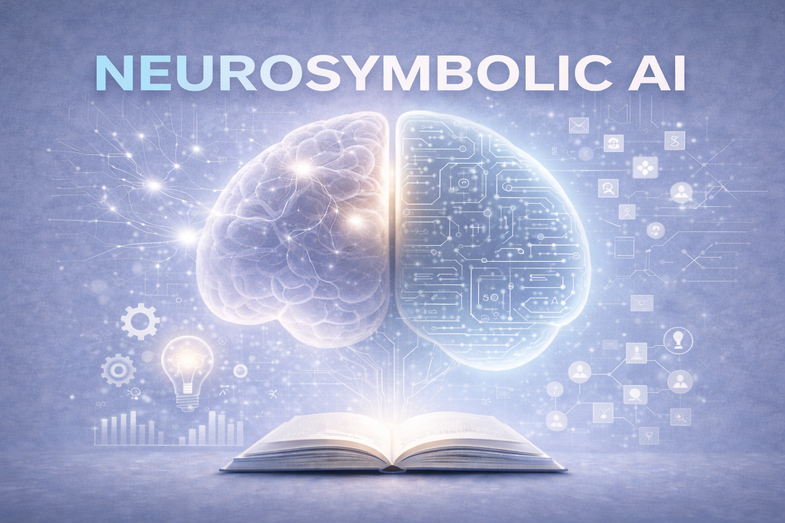

<link rel="stylesheet" href="custom.css">

<table style="border-collapse:collapse; border:0; width:100%;">
  <tr>
    <td style="border:0; padding:0 16px 0 0; vertical-align:top; width:260px;">
      
    </td>
    <td style="border:0; padding:0; vertical-align:top;">
      

        <em>
          This is an open-access resource for a subset of the materials (syllabus, readings, lecture slides) for
          DATASCI 290: Neurosymbolic AI: Building Consequence-Aware Cognitive Agents, an elective course I am teaching
          at the Information School at UC Berkeley in Spring 2026.
        </em>
      

    </td>
  </tr>
</table>

## Course Description
This course explores neurosymbolic artificial intelligence (AI), an emerging approach that integrates the statistical power of modern machine learning with the rigor and transparency of symbolic reasoning. While large language models excel at generating fluent responses, they often lack reliability, consistency, and grounding in verified knowledge. These limitations make them risky for use in domains such as healthcare, emergency response, and fact-checking, where errors or omissions can carry significant consequences. Neurosymbolic AI addresses these challenges by combining data-driven learning with explicit rules, logical inference, and structured knowledge to create AI systems that are both powerful and trustworthy.

Designed for working professionals, this course equips students with the expertise to design and implement trustworthy cognitive agents. Participants will begin by exploring foundational theories of human reasoning, drawing on the work of Kahneman and Tversky on dual-process cognition and biases in judgment. Building on this foundation, the course dives into practical architectures for combining neural and symbolic components, with an emphasis on knowledge representation, logic programming, and deductive reasoning. Students will gain hands-on experience with modern frameworks, where they will learn to construct knowledge graphs, encode rules, and integrate large language models with symbolic verifiers. The course culminates in a team-based project where students develop an end-to-end neurosymbolic agent in a real-world domain, preparing them to critically assess and build next-generation AI solutions for high-consequence applications.

## Lecture Slides

- **Lecture 1:** [AI Agents, with Consequences](slides/lecture01-ai-agents-with-consequences.pdf)
- **Lecture 2:** [Engineering Consequence-Aware Cognitive Agents](slides/lecture02-consequence-aware-agents.pdf)
- **Lecture 3:** [From Fast Guesses to Accountable Decisions](slides/lecture03-fast-vs-accountable.pdf)
- **Lecture 4:** [The Value of Structured Knowledge](slides/lecture04-structured-knowledge.pdf)

## Lectures

## Lecture 1: AI Agents, with Consequences
Establish why probabilistic accuracy alone is insufficient when decisions carry serious consequences. Demonstrate through concrete examples (healthcare, safety-critical systems, regulatory domains) how LLM failures arise from lack of constraints, traceability, and accountability. Motivate the fundamental requirement for explainability, consistency, and verifiable control in systems that affect human safety, legal compliance, and critical infrastructure.

### Readings
- Sheth, A., Roy, S., & Gaur, M. (2023). *Neurosymbolic AI—Why, What, and How*. IEEE Intelligent Systems, 38(6), 14-26.  
  - [PDF]
  - Article at Berkeley Library

---

## Lecture 2: Engineering Consequence-Aware Cognitive Agents
Introduce the reference architecture for consequence-aware agents: perception → structured knowledge → rules/constraints → checking/repair → action. Position neurosymbolic AI as the engineering paradigm that combines "neural fluency" (pattern recognition, language understanding) with "explicit knowledge" (facts, ontologies, provenance) and "verifiable control" (rules, constraints, formal checks). Show how this architecture addresses the failures identified in Lecture 1 and sets up the technical components the course will develop.

### Readings
- Mehta, N., Hartvigsen, T., & Koenecke, A. (2024). *A future role for health applications of large language models depends on regulators enforcing safety standards*. The Lancet Digital Health, 6(8), e585-e586. [PDF]
- Gaur, M., & Sheth, A. (2024). *Building trustworthy NeuroSymbolic AI Systems: Consistency, reliability, explainability, and safety*. AI Magazine, 45(1), 14-26. [PDF]
- Kahneman, D., & Tversky, A. (1974). *Judgment under uncertainty: Heuristics and biases*. Science, 185(4157), 1124–1131. [PDF]

---

## Lecture 3: From Fast Guesses to Accountable Decisions
Modern LLMs excel at fast, fluent responses but high-consequence domains demand deliberate, verifiable reasoning. This lecture translates dual-process cognitive theory into the reference architecture that structures the course: Perception → Structured Knowledge → Rules/Constraints → Verification → Action. We examine failure modes when any layer is absent, using examples from healthcare and finance to show why each component is non-negotiable and why structured knowledge sits at the core.

### Readings
- Sumers, T. R., Ho, M. K., Hawkins, R. D., et al. (2023). *Cognitive Architectures for Language Agents (CoALA)*. Transactions on Machine Learning Research. [PDF]

---

## Lecture 4: The Value of Structured Knowledge (Knowledge Graphs)
What form should structured knowledge take? This lecture builds the empirical case for knowledge graphs by enumerating requirements: explicit representation, compositional structure, constraint binding, traceability, evolvability, and queryability. We present evidence showing structured knowledge reduces hallucinations, enables multi-hop reasoning, and supports accountability where alternatives like vector embeddings and unstructured text fail.

### Readings
- Agrawal, G., Kumarage, T., Alghamdi, Z., & Liu, H. (2024). *Can Knowledge Graphs Reduce Hallucinations in LLMs?: A Survey*. Proceedings of NAACL 2024, 3947-3960. [PDF]
- Li, H., Appleby, G., Alperin, K., Gomez, S. R., & Suh, A. (2025). *Mitigating LLM Hallucinations with Knowledge Graphs: A Case Study*. [PDF]

---

## Lecture 5: Knowledge Graphs
A knowledge graph represents facts as entities connected by labeled relationships, fundamentally different from storing information in tables or documents. This lecture shows what graphs look like, how they capture the web of connections between facts, and why this structure matters for representing knowledge that agents can reason over. Moving from the abstract dual-process framework to concrete implementation requires choosing a representation, and graphs provide the explicit structure that makes knowledge queryable and verifiable.

### Readings
- Hogan, A., Blomqvist, E., Cochez, M., d'Amato, C., Melo, G. D., Gutierrez, C., Kirrane, S., Gayo, J. E. L., Navigli, R., & Neumaier, S. (2021). *Knowledge Graphs (Book)*. Springer Verlag. [PDF]

---

## Lecture 6: Why Consequence-Aware Agents Need Knowledge Graphs
Accountable agents must explain their reasoning, verify facts against trusted sources, and trace how they reached conclusions. This lecture shows why knowledge graphs are essential for these capabilities: their explicit structure enables systematic verification, their relationships provide reasoning chains, and their provenance tracking shows where each fact originated. Without structured knowledge in graph form, agents remain black boxes that can guess but cannot justify their decisions with auditable evidence.

### Readings
- Balog et al. (2024). *Knowledge Graphs Meet Multi-Modal Learning: A Comprehensive Survey*. arXiv:2402.05391. [PDF]

---

## Lecture 7: Introducing Knowledge Graph RAG and Querying Basics
Language models need external knowledge to answer questions accurately, but their context windows cannot fit entire knowledge bases. Knowledge Graph RAG solves this by retrieving only the relevant facts from a graph and injecting them into the model's prompt as context. This lecture shows how the process works: find the entities the question mentions, navigate the graph to gather connected facts, and extract just the subgraph needed to answer the question.

### Readings
- He et al. (2024). *G-Retriever: Retrieval-Augmented Generation for Textual Graph Understanding and Question Answering*. NeurIPS 2024. [PDF]
- Edge et al. (2024). *From Local to Global: A Graph RAG Approach to Query-Focused Summarization*. Microsoft Research. [PDF]

---

## Lecture 8: Knowledge Graph RAG in Practice
Building on the retrieval mechanics from Lecture 7, this lecture walks through complete examples showing how questions become answers through graph-grounded reasoning. The agent identifies relevant entities, retrieves their relationships and connected facts, and uses this structured knowledge to generate responses with clear provenance. This approach gives agents access to verifiable external knowledge, moving us closer to systems that can justify their answers with explicit evidence rather than opaque pattern matching.

### Readings
- Xiangrong Zhu, Yuexiang Xie, Yi Liu, Yaliang Li, and Wei Hu. (2025). *Knowledge Graph-Guided Retrieval Augmented Generation*. Proceedings of the 2025 NAACL (Volume 1), ACL. [PDF]
- Zhang, Q., Dong, J., Chen, H., Zha, D., Yu, Z., & Huang, X. (2024). *KnowGPT: Knowledge graph based prompting for large language models*. Advances in Neural Information Processing Systems, 37, 6052-6080. [PDF]

---

## Lecture 9: Beyond Basic Retrieval - Iterative and Multi-Hop Reasoning
Simple Knowledge Graph RAG retrieves facts once and hands them to the model, but complex questions often require multiple retrieval steps as understanding deepens. This lecture explores approaches where agents iteratively query the graph, using initial answers to guide subsequent searches, or plan multi-hop reasoning paths before retrieval. These methods show how agents can navigate knowledge systematically rather than hoping a single retrieval captures everything needed.

### Readings
- Ma, S., Xu, C., Jiang, X., Li, M., Qu, H., Yang, C., Mao, J., & Guo, J. (2025). *Think-on-Graph 2.0: Deep and faithful large language model reasoning with knowledge-guided retrieval augmented generation*. ICLR 2025. [PDF]
- Son, J., Seonwoo, Y., Yoon, S., Thorne, J., & Oh, A. (2024). *Multi-hop database reasoning with virtual knowledge graph*. KaLLM 2024 (pp. 1-11). ACL. [PDF]

---

## Lecture 10: Reasoning Capabilities and Limitations in Modern LLMs
Today's frontier models demonstrate impressive reasoning through techniques like chain-of-thought prompting, self-verification, and planning, but they still struggle with tasks requiring precise logic or verifiable facts. This lecture examines what reasoning patterns emerge naturally from language models versus what requires external structure to guarantee correctness. Understanding these boundaries reveals why even sophisticated LLMs need knowledge graphs and rule systems, pointing toward the architectural principles for truly accountable agents.

### Readings
- Mirzadeh et al. (2025). *GSM-Symbolic: Understanding the Limitations of Mathematical Reasoning in Large Language Models*. ICLR 2025. [PDF]
- Valmeekam et al. (2025). *On the Self-Verification Limitations of Large Language Models on Reasoning and Planning Tasks*. ICLR 2025. [PDF]

---

## Lecture 11: Computable Rules and Policies
Knowledge graphs represent factual information, but agents require actionable policies to transform facts into decisions. This lecture establishes how rule-based systems bridge knowledge and action, grounded in the domain of medical diagnostic agents. Clinical Practice Guidelines – that encode the logic that translates patient symptoms, test results, and medical histories into diagnostic conclusions and treatment recommendations, serve as the illustrative framework. Examining these medical decision protocols reveals fundamental principles for designing rule-based reasoning applicable to any cognitive agent requiring explicit, accountable decision-making.

### Readings
- SNOMED International - SNOMED CT Educational Materials (2024). Links to an external site.
- (2024). Clinical Quality Language (CQL) Specification. Links to an external site.
- (2024). FHIR Clinical Practice Guidelines (CPG) Implementation Guide v2.0.0. Links to an external site.

---

## Lecture 12: Representing and Executing Rules for Agent Decisions
Clinical guidelines demonstrate what rule-based reasoning looks like in practice, but agents need computable representations to follow them systematically. This lecture shows how to encode rules that reference knowledge graph facts, evaluate conditions against patient data, and execute recommended actions with explicit justification.

### Readings
- Boxwala, A. A., et al. (2011). *A multi-layered framework for disseminating knowledge for computer-based decision support*. Journal of the American Medical Informatics Association, 18(1). https://academic.oup.com/jamia/article/18/Supplement_1/i132/831199 Links to an external site.
- Peleg, M. (2013). *Computer-interpretable clinical guidelines: A methodological review*. Journal of Biomedical Informatics, 46(4), 744-763. https://www.sciencedirect.com/science/article/pii/S1532046413000561 Links to an external site.
- Sutton, R. T., et al. (2020). *An overview of clinical decision support systems: benefits, risks, and strategies for success*. npj Digital Medicine, 3, 17. https://www.nature.com/articles/s41746-020-0221-y Links to an external site.

---

## Lecture 13: Why Probabilistic Reasoning Isn't Enough
Language models operate through probability and pattern matching, which works well for generating plausible text but fails when correctness is mandatory. This lecture shows why hard constraints matter: certain rules must never be violated, specific conditions must always be checked, and safety requirements must be strictly enforced. When decisions have real consequences, neural approximation cannot provide the guarantees that formal verification delivers.

### Readings
- Park et al. (2024). *Grammar-Aligned Decoding*. NeurIPS 2024. Links to an external site.
- Zhang et al. (2024). *The Fusion of Large Language Models and Formal Methods for Trustworthy AI Agents: A Roadmap*. https://arxiv.org/abs/2412.06512 Links to an external site.

---

## Lecture 14: First-Order Logic and Rule Languages for Agents
Symbolic logic systems like Prolog and Datalog provide the computational foundation for enforcing hard constraints over knowledge graphs. This lecture introduces how these languages express rules, query facts, and derive conclusions with mathematical certainty rather than statistical confidence. By layering symbolic reasoning over neural perception, agents gain the ability to verify compliance, detect violations, and prove that their decisions satisfy mandatory constraints.

### Readings
- Vakharia et al. (2024). *ProSLM: A Prolog Synergized Language Model for explainable Domain Specific Knowledge Based Question Answering*. NeSy 2024. https://arxiv.org/abs/2409.11589 Links to an external site.
- Kim and Wang (2025). *Large Language Models for Interpretable Mental Health Diagnosis*. https://arxiv.org/abs/2501.07653 Links to an external site.

---

## Lecture 15: Knowledge Graph Instantiation
Moving from concepts to implementation requires choosing concrete tools and understanding their capabilities. This lecture introduces Neo4j AuraDB as the knowledge graph database, showing how to model domain knowledge as property graphs, load data, and structure facts for symbolic reasoning. We build our first working knowledge graph, and see how entities, relationships, and properties become the factual substrate that logic programs will query and reason over.

---

## Lecture 16: Querying and Extracting Facts
Symbolic reasoning systems need to retrieve facts from the knowledge graph to evaluate rules and derive conclusions. This lecture teaches the Cypher query language for knowledge graphs, that supports logical inference, extracting entity properties, traversing relationships, and pulling subgraphs that match rule premises. We learn how graph queries become the bridge between stored facts and the logic engines that reason over them.

---

## Lecture 17: Symbolic Reasoning
Logic programming systems, like PyDatalog, express rules and perform inference with mathematical certainty over knowledge graph facts. We introduce the Datalog syntax, showing how to define predicates, write rules, query facts from Memgraph, and derive conclusions through forward and backward chaining. Students implement decision logic in PyDatalog, seeing how declarative rules replace procedural code and provide explicit reasoning traces.

---

## Lecture 18: Neurosymbolic Systems with DeepProbLog
DeepProbLog extends logic programming by integrating neural networks as probabilistic predicates within logical rules. This lecture shows how to define neural components in DeepProbLog, connect them to symbolic rules, perform probabilistic inference over combined neural-symbolic models, and train end-to-end through gradient descent. Students build systems where neural perception feeds directly into logical reasoning, implementing the neurosymbolic integration that defines the course.

---

## Lecture 19: Building Multi-Agent Systems
Production neurosymbolic applications require orchestrating multiple components: perception agents, reasoning agents, verification agents, and action agents working together. This lecture introduces LangGraph for building and coordinating agent systems, showing how to structure agent workflows, manage state across reasoning steps, and integrate AuraDB and logic engines into agent pipelines.

---

## Lecture 20: Complete System Integration and Deployment
We bring together the complete implementation stack: AuraDB for knowledge storage, Cypher for retrieval, PyDatalog for rule-based reasoning, DeepProbLog for neurosymbolic inference, and LangGraph for agent orchestration. This lecture presents complete working systems, debugging strategies for neurosymbolic pipelines, and deployment patterns for production environments.

---

## Lecture 23: Advanced Prompting and Reasoning Strategies
Language models can perform complex reasoning when prompted to show their work through chain-of-thought approaches, and their accuracy improves dramatically when sampling multiple reasoning paths and selecting answers by majority vote through self-consistency. Recent techniques also enable models to verify their own reasoning by generating and checking alternative solutions. These prompting strategies reveal both what pure neural approaches can achieve and where probabilistic reasoning falls short of the guarantees accountable systems require.

### Readings
- Wang et al. (2023). *Self-Consistency Improves Chain of Thought Reasoning in Language Models*. ICLR 2023. https://openreview.net/forum?id=1PL1NIMMrw Links to an external site.
- Dhuliawala et al. (2024). *Chain-of-Verification Reduces Hallucination in Large Language Models*. ACL 2024 Findings. https://aclanthology.org/2024.findings-acl.212/ Links to an external site.
- Ling et al. (2023). *Deductive Verification of Chain-of-Thought Reasoning*. NeurIPS 2023. https://proceedings.neurips.cc/paper_files/paper/2023/hash/d968e3b6e4c1203d0bd9d9ff5d2e96e1-Abstract-Conference.html Links to an external site.

---

## Lecture 24: Reasoning Models and Reinforcement Learning
The latest generation of reasoning models like OpenAI's o1 and DeepSeek's R1 are explicitly trained via reinforcement learning to engage in extended reasoning processes, learning to allocate computational resources dynamically and spend more time on harder problems. These models develop reasoning strategies through trial and error rather than pure next-token prediction. By examining the ceiling of what pure neural methods can achieve, we see why symbolic verification remains essential for domains requiring absolute correctness rather than high probability.

### Readings
- DeepSeek-AI (2025). *DeepSeek-R1: Incentivizing Reasoning Capability in LLMs via Reinforcement Learning*. https://arxiv.org/abs/2501.12948
- Li, S.S., Mun, J., Brahman, F., Ilgen, J., Tsvetkov, Y., & Sap, M. (2025). *ALFA: Aligning LLMs to Ask Good Questions A Case Study in Clinical Reasoning*. https://arxiv.org/abs/2502.14860

---

## Lecture 25: AlphaProof and AlphaGeometry - Neurosymbolic Theorem Proving
DeepMind's AlphaProof and AlphaGeometry 2 achieved silver medal performance at the 2024 International Mathematical Olympiad by explicitly combining neural and symbolic components. AlphaProof translates natural language problems into formal Lean proofs using a fine-tuned Gemini model, then searches for solutions using AlphaZero-style reinforcement learning with symbolic verification at every step. These systems demonstrate that neurosymbolic integration is not just theoretically appealing but practically necessary for tasks requiring mathematical rigor and accountability.

### Readings
- Hubert et al. (2025). *Olympiad-level formal mathematical reasoning with reinforcement learning (AlphaProof)*. Nature. https://www.nature.com/articles/s41586-025-09833-y Links to an external site.
- Trinh et al. (2024). *AlphaGeometry: Solving olympiad geometry without human demonstrations*. Nature 630, 1042-1049. https://www.nature.com/articles/s41586-024-07603-8 Links to an external site.
- Li et al. (2025). *Proving Olympiad Inequalities by Synergizing LLMs and Symbolic Reasoning*. ICLR 2025. https://openreview.net/forum?id=nnVO1PvbTv Links to an external site.

---

## Lecture 26: Practical Neurosymbolic Frameworks and Graph-Based Reasoning
Practical neurosymbolic systems like LINC and Logic-LM integrate language models with symbolic solvers by translating natural language to formal logic and offloading verification to established theorem provers. Graph-based reasoning approaches like Graph of Thoughts and Think-on-Graph structure the search through solution spaces as explicit graph traversal, combining neural heuristics with symbolic constraints. Together these frameworks demonstrate the core neurosymbolic principle: neural networks provide perception and guidance while symbolic systems deliver the verified reasoning that accountable medical AI requires.

### Readings
- Olausson et al. (2023). *LINC: A Neurosymbolic Approach for Logical Reasoning by Combining Language Models with First-Order Logic Provers*. EMNLP 2023. https://aclanthology.org/2023.emnlp-main.313/ Links to an external site.
- Pan et al. (2023). *Logic-LM: Empowering Large Language Models with Symbolic Solvers for Faithful Logical Reasoning*. EMNLP 2023 Findings. https://aclanthology.org/2023.findings-emnlp.248/ Links to an external site.
- Ganguly et al. (2024). *PROOF OF THOUGHT: Neurosymbolic Program Synthesis allows Robust and Interpretable Reasoning*. NeurIPS'24 Workshop on System-2 Reasoning. https://openreview.net/forum?id=Pxx3r14j3UL Links to an external site.
- Besta et al. (2024). *Graph of Thoughts: Solving elaborate problems with large language models*. PVLDB 17(10), 2411-2425. https://vldb.org/pvldb/vol17/p2411-besta.pdf Links to an external site.
- Sun et al. (2024). *Think-on-Graph: Deep and Responsible Reasoning of Large Language Model on Knowledge Graph*. ICLR 2024. https://openreview.net/forum?id=nnVO1PvbTv Links to an external site.

