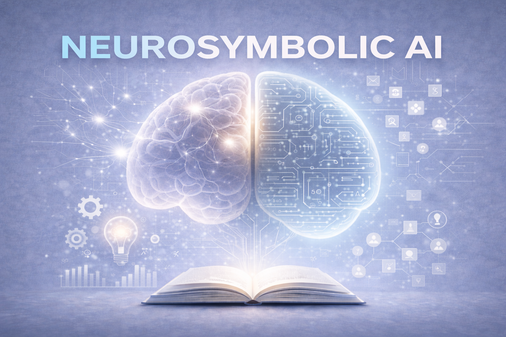

<html lang="en">
<head>
  <meta charset="utf-8" />
  <meta name="viewport" content="width=device-width, initial-scale=1" />
  <title>Neurosymbolic AI: Building Consequence-Aware Cognitive Agents</title>

  
</head>

<body>
  <main class="wrap">
    

      
      

        <h2>Neurosymbolic AI: Building Consequence-Aware Cognitive Agents</h2>
        <i>
          This is an open-access resource for a subset (the course topics, specific readings, and lecture slides) of the course
          materials for DATASCI 290: Neurosymbolic AI: Building Consequence-Aware Cognitive Agents, offered at UC Berkeley Spring 2026.
          Lecture slides will be added progressively as we run through the Spring ’26 semester.
        </i>
        <a href="https://www.linkedin.com/in/naveenashish/">Naveen Ashish</a> (Instructor)
      

    

    <section class="section" id="course-description">
      <h2>Course Description</h2>
      

        This course explores neurosymbolic artificial intelligence (AI), an emerging approach that integrates the
        statistical power of modern machine learning with the rigor and transparency of symbolic reasoning. While large
        language models excel at generating fluent responses, they often lack reliability, consistency, and grounding in
        verified knowledge. These limitations make them risky for use in domains such as healthcare, emergency response,
        and fact-checking, where errors or omissions can carry significant consequences. Neurosymbolic AI addresses these
        challenges by combining data-driven learning with explicit rules, logical inference, and structured knowledge to
        create AI systems that are both powerful and trustworthy.
      

      

        Designed for working professionals, this course equips students with the expertise to design and implement
        trustworthy cognitive agents. Participants will begin by exploring foundational theories of human reasoning,
        drawing on the work of Kahneman and Tversky on dual-process cognition and biases in judgment. Building on this
        foundation, the course dives into practical architectures for combining neural and symbolic components, with an
        emphasis on knowledge representation, logic programming, and deductive reasoning. Students will gain hands-on
        experience with modern frameworks, where they will learn to construct knowledge graphs, encode rules, and
        integrate large language models with symbolic verifiers. The course culminates in a team-based project where
        students develop an end-to-end neurosymbolic agent in a real-world domain, preparing them to critically assess
        and build next-generation AI solutions for high-consequence applications.
      

    </section>

    <section class="section" id="quick-links">
      <h2>Quick Links</h2>
      <ul class="toc">
        <li><a href="#lecture-slides">Lecture Slides</a></li>
        <li><a href="#lectures">Lectures</a></li>
        <li><a href="#books">Books</a></li>
        <li><a href="https://datasciencey.github.io/datasci290-neurosymbolic-ai/finalproject.html">Final Project</a></li>
        <li><a href="https://github.com/datasciencey/datasci290-code">Lecture Notebooks &amp; Code Scaffolds</a></li>
      </ul>
    </section>

    <section class="section" id="books">
      <h2>Books</h2>
      

        There isn't currently a textbook that provides good coverage of the topics of interest here. However, for some
        specific topics the following are good references:
      

      <ul>
        <li><strong>Knowledge Graphs</strong> <a href="slides/Knowledge Graphs Book.pdf">Knowledge Graphs, Hogan et. al. (Chapter 2)</a></li>
        <li><strong>Datalog</strong> <a href="slides/Foundations of Databases Book.pdf">Foundations of Databases, Abiteboul, Hull &amp; Vianu (Chapter 12: Datalog)</a></li>
      </ul>
    </section>

    <section class="section" id="lecture-slides">
      <h2>Lecture Slides</h2>
      <ul>
        <li><strong>Lecture 1:</strong> <i>(Jan 5)</i> <a href="slides/DATASCI290_Lecture1.pdf">Introduction to Neurosymbolic AI and Consequence-Aware Cognitive Agents</a></li>
        <li><strong>Lecture 2:</strong> <i>(Jan 7)</i> <a href="slides/DATASCI290_Lecture2.pdf">Healthcare: A Compelling Need for Neurosymbolic AI Solutions</a></li>
        <li><strong>Lecture 3:</strong> <i>(Jan 12)</i> <a href="slides/DATASCI290_Lecture3.pdf">Trustworthiness, Cognitive Architectures, Language Agents</a></li>
        <li><strong>Lecture 4:</strong> <i>(Jan 14)</i> <a href="slides/DATASCI290_Lecture4.pdf">Can Knowledge Graphs Reduce Hallucinations in LLMs, and How So?</a></li>
        <li><strong>Lecture 5:</strong> <i>(Jan 21)</i> <a href="slides/DATASCI290_Lecture5.pdf">Knowledge Graphs: Foundations of Consequence-Aware AI Agents I</a></li>
        <li><strong>Lecture 6:</strong> <i>(Jan 26)</i> <a href="slides/DATASCI290_Lecture6.pdf">Knowledge Graphs: Foundations of Consequence-Aware AI Agents II</a></li>
        <li><strong>Lecture 7:</strong> <i>(Jan 28)</i> <a href="slides/DATASCI290_Lecture7.pdf">Final Project (CareTrace); Knowledge Graphs Lab Assignment; G-Retriever (Graph LLM)</a></li>
        <li><strong>Lecture 8:</strong> <i>(Feb 2)</i> <a href="slides/DATASCI290_Lecture8.pdf">Graph LLM: Algorithm Walkthrough; KG-RAG Inference: Implementation</a></li>
        <li><strong>Lecture 9:</strong> <i>(Feb 4)</i> <a href="slides/DATASCI290_Lecture9.pdf">Datalog: Let's get LOGICAL</a></li>
        <li><strong>Lecture 10:</strong> <i>(Feb 9)</i> <a href="https://github.com/datasciencey/datasci290-code/blob/main/Lecture%20Notebooks/Lecture%209:%20pyDatalog/Datalog%20Fundamentals.ipynb">Datalog Fundamentals (pyDatalog Notebook)</a></li>
        <li><strong>Lecture 11:</strong> <i>(Feb 11)</i> <a href="slides/DATASCI290_Lecture11.pdf">Neurosymbolic lowering methods: inference-time, deep integration of knowledge graphs with LLMs</a></li>
        <li><strong>Lecture 12:</strong> <i>(Feb 18)</i> <a href="https://datahub.berkeley.edu/hub/user-redirect/git-pull?repo=https%3A%2F%2Fgithub.com%2Fdatasciencey%2Fdatasci290-code&branch=main&urlpath=lab%2Ftree%2Fdatasci290-code%2FCode+Scaffolds%2FKG+LLM+Fusion%2FKnowledge+Fusion+by+Rewiring+Attention.ipynb">Knowledge Fusion by Rewiring Attention: Implementation (Teaching Notebook)</a> and the accompanying <a href="slides/DATASCI290_Lecture12.pdf">code explanation slides.</a> </li>
        <li><strong>Lecture 13:</strong> <i>(Feb 23)</i> <a href="slides/DATASCI290_Lecture13.pdf">Model Reasoning: Capabilities, Limitations, Reasonable Expectations</a></li>
        <li><strong>Lecture 14:</strong> <i>(Feb 25)</i> <a href="slides/DATASCI290_Lecture14.pdf">(How) Do Models Reason?</a></li>
      </ul>
    </section>

    <section class="section" id="lectures">
      <h2>Lectures</h2>

      

        <h3>Lecture 1: AI Agents, with Consequences</h3>
        

          Establish why probabilistic accuracy alone is insufficient when decisions carry serious consequences.
          Demonstrate, through concrete examples (healthcare, safety-critical systems, regulatory domains), how LLM failures arise from missing constraints,
          weak traceability, and unclear accountability. Motivate the core requirement for explainability, consistency, and verifiable control in systems
          that affect human safety, legal compliance, and critical infrastructure.
        

        
Readings

        <ul>
          <li>Sheth, A., Roy, S., &amp; Gaur, M. (2023). <em>Neurosymbolic AI—Why, What, and How</em>. IEEE Intelligent Systems, 38(6), 14–26.</li>
        </ul>
      

      

        <h3>Lecture 2: Engineering Consequence-Aware Cognitive Agents</h3>
        

          Introduce a reference architecture for consequence-aware agents: perception → structured knowledge → rules/constraints → checking/repair → action.
          Position neurosymbolic AI as an engineering paradigm that combines neural fluency (pattern recognition, language understanding) with explicit knowledge
          (facts, ontologies, provenance) and verifiable control (rules, constraints, formal checks). Show how the architecture addresses the failures from
          Lecture 1 and frames the technical components the course will build.
        

        
Readings

        <ul>
          <li>Mehta, N., Hartvigsen, T., &amp; Koenecke, A. (2024). <em>A future role for health applications of large language models depends on regulators enforcing safety standards</em>. The Lancet Digital Health, 6(8), e585–e586.</li>
          <li>Gaur, M., &amp; Sheth, A. (2024). <em>Building trustworthy NeuroSymbolic AI Systems: Consistency, reliability, explainability, and safety</em>. AI Magazine, 45(1), 14–26.</li>
          <li>Kahneman, D., &amp; Tversky, A. (1974). <em>Judgment under uncertainty: Heuristics and biases</em>. Science, 185(4157), 1124–1131.</li>
        </ul>
      

      

        <h3>Lecture 3: Trustworthiness, Cognitive Architectures, Language Agents</h3>
        

          Modern LLMs excel at fast, fluent responses, but high-consequence domains demand deliberate, verifiable reasoning.
          This lecture translates dual-process cognitive theory into the course’s reference architecture: perception → structured knowledge → rules/constraints → verification → action.
          We examine failure modes when any layer is absent, using examples from healthcare and finance to show why each component is essential and why structured knowledge sits at the core.
        

        
Readings

        <ul>
          <li>Sumers, T. R., Ho, M. K., Hawkins, R. D., et al. (2023). <em>Cognitive Architectures for Language Agents (CoALA)</em>. Transactions on Machine Learning Research.</li>
        </ul>
      

      

        <h3>Lecture 4: The Value of Structured Knowledge (Knowledge Graphs)</h3>
        

          What form should structured knowledge take? This lecture builds the empirical case for knowledge graphs by enumerating requirements:
          explicit representation, compositional structure, constraint binding, traceability, evolvability, and queryability.
          We review evidence that structured knowledge reduces hallucinations, enables multi-hop reasoning, and supports accountability where alternatives like embeddings-only or unstructured text fall short.
        

        
Readings

        <ul>
          <li>Agrawal, G., Kumarage, T., Alghamdi, Z., &amp; Liu, H. (2024). <em>Can Knowledge Graphs Reduce Hallucinations in LLMs?: A Survey</em>. NAACL 2024, 3947–3960.</li>
          <li>Li, H., Appleby, G., Alperin, K., Gomez, S. R., &amp; Suh, A. (2025). <em>Mitigating LLM Hallucinations with Knowledge Graphs: A Case Study</em>.</li>
        </ul>
      

      

        <h3>Lecture 5: Knowledge Graphs</h3>
        

          A knowledge graph represents facts as entities connected by labeled relationships, which is fundamentally different from storing information in tables or documents.
          This lecture shows what graphs look like, how they capture networks of connections between facts, and why that structure matters for representing knowledge that agents can query and reason over.
          We connect the dual-process framework to concrete implementation choices, motivating graphs as an explicit, verifiable substrate.
        

        
Readings

        <ul>
          <li>Hogan, A., Blomqvist, E., Cochez, M., d’Amato, C., Melo, G. D., Gutierrez, C., Kirrane, S., Gayo, J. E. L., Navigli, R., &amp; Neumaier, S. (2021). <em>Knowledge Graphs</em>. Springer.</li>
        </ul>
      

      

        <h3>Lecture 6: Why Consequence-Aware Agents Need Knowledge Graphs</h3>
        

          Accountable agents must explain their reasoning, verify facts against trusted sources, and trace how they reached conclusions.
          This lecture shows why knowledge graphs are central: their explicit structure enables systematic verification, their relationships support reasoning chains, and their provenance mechanisms represent where facts came from.
          Without structured knowledge in graph form, agents may guess plausibly but cannot justify decisions with auditable evidence.
        

        
Readings

        <ul>
          <li>Balog et al. (2024). <em>Knowledge Graphs Meet Multi-Modal Learning: A Comprehensive Survey</em>. arXiv:2402.05391.</li>
        </ul>
      

      

        <h3>Lecture 7: Introducing Knowledge Graph RAG and Querying Basics</h3>
        

          Language models need external knowledge to answer questions accurately, but context windows cannot fit entire knowledge bases.
          Knowledge Graph RAG solves this by retrieving only the relevant facts from a graph and injecting them into the prompt as grounded context.
          This lecture shows the full retrieval loop: entity detection, graph navigation, subgraph extraction, and packaging evidence for generation.
        

        
Readings

        <ul>
          <li>He et al. (2024). <em>G-Retriever: Retrieval-Augmented Generation for Textual Graph Understanding and Question Answering</em>. NeurIPS 2024.</li>
          <li>Edge et al. (2024). <em>From Local to Global: A Graph RAG Approach to Query-Focused Summarization</em>. Microsoft Research.</li>
        </ul>
      

      

        <h3>Lecture 8: Knowledge Graph RAG in Practice</h3>
        

          Building on the retrieval mechanics from Lecture 7, this lecture walks through end-to-end examples showing how questions become answers through graph-grounded reasoning.
          The agent identifies relevant entities, retrieves connected facts, and generates responses that cite provenance.
          The goal is operational: systems that justify answers with explicit evidence rather than opaque pattern matching.
        

        
Readings

        <ul>
          <li>Zhu, X., Xie, Y., Liu, Y., Li, Y., &amp; Hu, W. (2025). <em>Knowledge Graph-Guided Retrieval Augmented Generation</em>. NAACL 2025.</li>
          <li>Zhang, Q., Dong, J., Chen, H., Zha, D., Yu, Z., &amp; Huang, X. (2024). <em>KnowGPT: Knowledge graph based prompting for large language models</em>. NeurIPS 37, 6052–6080.</li>
        </ul>
      

      

        <h3>Lecture 9: Datalog Fundamentals</h3>
        

          Introduce symbolic logic for neurosymbolic systems using Datalog as a database-oriented logic language.
          Cover extensional vs intensional databases (EDB/IDB), rules, safety, recursion, and fixpoint semantics.
          Motivate why Datalog is a natural bridge between knowledge graphs (facts) and executable rules (constraints, policies, clinical logic).
        

        
Readings

        <ul>
          <li>Abiteboul, S., Hull, R., &amp; Vianu, V. (1995). <em>Foundations of Databases</em>. Addison-Wesley. (selected chapters/sections)</li>
        </ul>
      

      

        <h3>Lecture 10: Programming with Datalog Using pyDatalog</h3>
        

          Hands-on implementation of Datalog concepts in Python using pyDatalog. Implement facts and rules, recursion, negation patterns (where supported),
          and explainable query outputs. Position pyDatalog as a lightweight “symbolic engine” that can be invoked by an agent and grounded against KG facts.
        

        
References

        <ul>
          <li>pyDatalog documentation and tutorials</li>
        </ul>
      

      

        <h3>Lecture 11: Knowledge Graph-Guided Attention</h3>
        

          Introduce “neurosymbolic lowering” methods that integrate structured knowledge directly into model computation at inference time (beyond prompt injection).
          Survey approaches including entity-aware attention, graph-augmented transformers, and constrained attention masks.
          Emphasize when deep integration helps (faithfulness, long-range structured dependencies) and where it adds complexity (alignment, maintenance, debugging).
        

        
Readings

        <ul>
          <li>Zhai, S., Qi, G., Wang, Y., &amp; Meng, Y. (2025). <em>Knowledge Fusion via Bidirectional Information Aggregation</em>. arXiv preprint arXiv:2507.08704.</li>
        </ul>
      

      

        <h3>Lecture 12: Knowledge Graph-Guided Attention Implementation</h3>
        

          Implementation-focused walkthrough of a KG-guided attention pipeline: data preparation, graph-to-model alignment (entity linking / concept IDs),
          attention modification hooks, debugging strategies, and evaluation. Connect the engineering steps to the conceptual promise: moving from “KG in the prompt”
          to “KG in the computation.”
        

      

      

        <h3>Lecture 13: Reasoning Capabilities and Limitations in Modern LLMs</h3>
        

          Examine what reasoning patterns emerge naturally from frontier LLMs (via prompting, self-verification, planning) versus what requires external structure to guarantee correctness.
          Focus on failure modes in precise logic, long-horizon planning, and verifiable factuality. Use these boundaries to motivate hybrid architectures:
          LLMs for proposal generation and symbolic/graph systems for checking, enforcing constraints, and certifying outputs.
        

        
Readings

        <ul>
          <li>Mirzadeh et al. (2025). <em>GSM-Symbolic: Understanding the Limitations of Mathematical Reasoning in Large Language Models</em>. ICLR 2025.</li>
          <li>Valmeekam et al. (2025). <em>On the Self-Verification Limitations of Large Language Models on Reasoning and Planning Tasks</em>. ICLR 2025.</li>
          <li>Kambhampati, S., Stechly, K., & Valmeekam, K. (2025). <em>(How) Do reasoning models reason?.</em> Annals of the New York Academy of Sciences, 1547(1), 33-40.</li>
        </ul>
      

      

        <h3>Lecture 14: Graph Embeddings and Representation Learning</h3>
        

          Introduce embedding-based representations for graphs and how they complement symbolic representations. Cover random-walk methods (DeepWalk/node2vec),
          knowledge graph embeddings (TransE/RotatE-style families), and practical toolchains such as PyKeen. Discuss how embeddings support retrieval, similarity search,
          and prediction, and how to maintain accountability (link embeddings back to explicit facts and provenance). We will also take look at ClinVec (embeddings of clinical codes).
        

      

      

        <h3>Lecture 15: Why Probabilistic Reasoning Isn’t Enough</h3>
        

          Language models operate through probability and pattern matching, which generates plausible text but cannot guarantee correctness when hard constraints must never be violated.
          This lecture introduces constraint enforcement and formal methods as the missing layer for safety, compliance, and mission-critical decision-making.
          We map “constraint types” (schema constraints, logical constraints, temporal constraints, safety constraints) to enforcement techniques.
        

        
Readings

        <ul>
          <li>Park et al. (2024). <em>Grammar-Aligned Decoding</em>. NeurIPS 2024.</li>
          <li>Zhang et al. (2024). <em>The Fusion of Large Language Models and Formal Methods for Trustworthy AI Agents: A Roadmap</em>. arXiv:2412.06512.</li>
        </ul>
      

      

        <h3>Lecture 16: Representing and Executing Rules for Agent Decisions</h3>
        

          Clinical guidelines illustrate what rules look like in practice, but accountable agents need computable representations.
          This lecture shows how to encode rule logic (often as Datalog-like rules) that references knowledge graph facts,
          evaluates conditions against case data, and produces recommended actions with explicit justifications and traceable evidence.
          We also discuss lifecycle issues: versioning, provenance, governance, and audit trails.
        

        
Readings

        <ul>
          <li>Boxwala, A. A., et al. (2011). <em>A multi-layered framework for disseminating knowledge for computer-based decision support</em>. Journal of the American Medical Informatics Association, 18(1).</li>
          <li>Peleg, M. (2013). <em>Computer-interpretable clinical guidelines: A methodological review</em>. Journal of Biomedical Informatics, 46(4), 744–763.</li>
          <li>Sutton, R. T., et al. (2020). <em>An overview of clinical decision support systems: benefits, risks, and strategies for success</em>. npj Digital Medicine, 3, 17.</li>
        </ul>
      

      

        <h3>Lecture 17: Integrating Logic and LLMs</h3>
        

          Survey loosely coupled and tightly coupled integration patterns between LLMs and logic engines (especially Datalog).
          Topics include: LLM-as-parser (natural language to rules), LLM-as-proposer (candidate actions) plus logic-as-checker,
          interactive explanations of rule outputs, and verified reasoning workflows that treat the LLM as an assistant rather than an authority.
        

        
Readings

        <ul>
          <li>Baldazzi, T., Bellomarini, L., Ceri, S., Colombo, A., Gentili, A., &amp; Sallinger, E. (2024). <em>“Please, Vadalog, tell me why”: Interactive Explanation of Datalog-based Reasoning</em>. OpenProceedings.</li>
          <li>Sistla, M., Balakrishnan, G., Rondon, P., Cambronero, J., Tufano, M., &amp; Chandra, S. (2025). <em>Towards Verified Code Reasoning by LLMs</em>. arXiv:2509.26546.</li>
        </ul>
      

      

        <h3>Lecture 18: Building Multi-Agent Systems</h3>
        

          Production neurosymbolic applications require orchestrating multiple components: perception agents, retrieval agents, reasoning agents, verification agents,
          and action agents. This lecture introduces LangGraph as a framework for building and coordinating multi-agent workflows, managing shared state,
          and integrating external systems (AuraDB, logic engines, tools) into robust pipelines.
        

        
Readings

        <ul>
          <li>LangGraph documentation</li>
          <li>Selected agentic design patterns: state machines, tool-routing, verifier loops, and human-in-the-loop checkpoints (course notes)</li>
        </ul>
      

      

        <h3>Lecture 19: Complete System Integration and Deployment</h3>
        

          Bring together the implementation stack: AuraDB for knowledge storage, Cypher for retrieval, pyDatalog (or equivalent) for rule execution,
          embeddings for retrieval and prediction, KG-RAG for grounded generation, and LangGraph for orchestration. Focus on “systems engineering”:
          observability, debugging, evaluation harnesses, versioning (data, prompts, rules), and deployment patterns suitable for real organizational settings.
        

      

      

        <h3>Lecture 20: Final Project Workshop: CareTrace</h3>
        

          Project-focused lecture after Lecture 19. Translate the full architecture into the CareTrace domain: define the KG schema, data ingestion,
          rule sets (guidelines + constraints), verification checkpoints, and multi-agent orchestration plan. Emphasize deliverables: traceable decisions,
          evidence-backed outputs, and clear evaluation criteria (correctness, safety, auditability).
        

      

      

        <h3>Lecture 21: Advanced Prompting and Reasoning Strategies</h3>
        

          Study how far “pure neural” methods can go: chain-of-thought prompting (as a technique, not as a guarantee), self-consistency, and chain-of-verification.
          Frame these as performance boosters that still require symbolic/graph-based checks when correctness must be guaranteed.
          Discuss failure modes under distribution shift, adversarial cases, and incomplete context.
        

        
Readings

        <ul>
          <li>Wang et al. (2023). <em>Self-Consistency Improves Chain of Thought Reasoning in Language Models</em>. ICLR 2023.</li>
          <li>Dhuliawala et al. (2024). <em>Chain-of-Verification Reduces Hallucination in Large Language Models</em>. ACL 2024 Findings.</li>
          <li>Ling et al. (2023). <em>Deductive Verification of Chain-of-Thought Reasoning</em>. NeurIPS 2023.</li>
        </ul>
      

      

        <h3>Lecture 22: Reasoning Models and Reinforcement Learning</h3>
        

          Introduce reasoning-optimized models trained with reinforcement learning to perform extended deliberation and allocate more compute to harder problems.
          Use this to clarify what training can improve (search, planning heuristics, self-correction) and what still benefits from symbolic verification
          (hard constraints, compliance rules, formal correctness). Position RL-trained reasoning as complementary to, not a replacement for, explicit constraints and provable checks.
        

        
Readings

        <ul>
          <li>DeepSeek-AI (2025). <em>DeepSeek-R1: Incentivizing Reasoning Capability in LLMs via Reinforcement Learning</em>.</li>
          <li>Li, S. S., Mun, J., Brahman, F., Ilgen, J., Tsvetkov, Y., &amp; Sap, M. (2025). <em>ALFA: Aligning LLMs to Ask Good Questions — A Case Study in Clinical Reasoning</em>.</li>
        </ul>
      

      

        <h3>Lecture 23: AlphaProof and AlphaGeometry: Neurosymbolic Theorem Proving</h3>
        

          Study neurosymbolic theorem proving as a canonical example of accountability: neural components propose and guide search, symbolic components verify every step.
          Cover how formalization (Lean), search (AlphaZero-style), and proof checking create guarantees that are unattainable with probabilistic text generation alone.
          Translate the lesson back to medical and compliance agents: constrained action spaces, verifiable intermediate steps, and auditable proof traces.
        

        
Readings

        <ul>
          <li>Hubert et al. (2025). <em>Olympiad-level formal mathematical reasoning with reinforcement learning (AlphaProof)</em>. Nature.</li>
          <li>Trinh et al. (2024). <em>AlphaGeometry: Solving olympiad geometry without human demonstrations</em>. Nature 630, 1042–1049.</li>
          <li>Li et al. (2025). <em>Proving Olympiad Inequalities by Synergizing LLMs and Symbolic Reasoning</em>. ICLR 2025.</li>
        </ul>
      

      

        <h3>Lecture 24: Practical Neurosymbolic Frameworks: Translating Language to Logic</h3>
        

          Survey practical systems that combine LLMs with symbolic solvers by translating natural language into formal logic and offloading verification to a solver/prover.
          Focus on the engineering questions: what gets translated, how ambiguity is handled, how explanations are generated, and how solver results are fed back into the agent loop.
        

        
Readings

        <ul>
          <li>Olausson et al. (2023). <em>LINC: A Neurosymbolic Approach for Logical Reasoning by Combining Language Models with First-Order Logic Provers</em>. EMNLP 2023.</li>
          <li>Pan et al. (2023). <em>Logic-LM: Empowering Large Language Models with Symbolic Solvers for Faithful Logical Reasoning</em>. EMNLP 2023 Findings.</li>
        </ul>
      

      

        <h3>Lecture 25: Graph-Based Reasoning as Search: Graph of Thoughts and Think-on-Graph</h3>
        

          Treat reasoning as explicit search over a graph of intermediate states, using the LLM for proposal/guidance and graph structure for control, pruning, and traceability.
          Discuss how graph-structured reasoning supports tool use, multi-step planning, and more transparent failure diagnosis than monolithic prompting.
        

        
Readings

        <ul>
          <li>Besta et al. (2024). <em>Graph of Thoughts: Solving elaborate problems with large language models</em>. PVLDB 17(10), 2411–2425.</li>
          <li>Sun et al. (2024). <em>Think-on-Graph: Deep and Responsible Reasoning of Large Language Model on Knowledge Graph</em>. ICLR 2024.</li>
        </ul>
      

      

        <h3>Lecture 26: Neurosymbolic Program Synthesis and Verified Reasoning Workflows</h3>
        

          Close the course with frameworks that explicitly target robustness and interpretability via program synthesis and verification-style loops.
          Emphasize the architectural pattern: LLM proposes structured artifacts (programs, rules, plans), symbolic systems validate them,
          and the agent iterates until constraints are satisfied. This becomes a reusable recipe for high-consequence domains
          (clinical decision support, compliance, safety-critical operations).
        

        
Readings

        <ul>
          <li>Ganguly et al. (2024). <em>Proof of Thought: Neurosymbolic Program Synthesis Allows Robust and Interpretable Reasoning</em>. NeurIPS 2024 Workshop on System-2 Reasoning.</li>
          <li>Sistla et al. (2025). <em>Towards Verified Code Reasoning by LLMs</em>. arXiv:2509.26546.</li>
        </ul>
      

    </section>

  </main>
</body>
</html>
